# SchoolTwin Complete Product Manual

> Pilot backend update (25 August 2026): this manual includes older
> frontend-first assessments. The current production backend contract is
> [`backend-architecture-v1.md`](backend-architecture-v1.md), with operating and
> restore steps in [`backend-runbook.md`](backend-runbook.md) and
> [`restore-runbook.md`](restore-runbook.md). The fictional demo remains local
> and separate.

> Canonical guide to the current SchoolTwin School Collection App, its limits,
> its hackathon use, and its path to production.

**Repository evidence date:** 23 August 2026

**Current database shape:** SchoolTwin browser database version 5

**Current demo school:** Sundarpur Government High School, Odisha
**Main rule:** Collection tools collect observations, not conclusions.

## How to read this manual

Every important claim uses one of these labels:

| Label                    | Meaning                                                                            |
| ------------------------ | ---------------------------------------------------------------------------------- |
| **IMPLEMENTED**          | The current code contains this behavior. It may still have limits.                 |
| **PROTOTYPE-ONLY**       | It works locally for the hackathon, but it is not a production security guarantee. |
| **PLANNED / PRODUCTION** | It needs a real server, stronger controls, policy, or field work.                  |
| **FUTURE OFFICIALS APP** | It belongs in a separate app for authorized officials, not in this school app.     |

The word **operator** means the adult who looks after the SchoolTwin tablet or
computer at the school. The operator is allowed to start school work, but is not
treated as an unquestioned source of truth.

---

## 1. Executive summary

SchoolTwin is designed as two separate products.

1. The **School Collection App** asks a school to complete simple daily work:
   class checks, live videos, a facility check, private student questions, and
   problem reports.
2. A **future Officials App** would receive those observations and compare them
   with other records. Only that future app would show gaps, warnings, trends,
   or follow-up work.

This repository contains only the first product.

**IMPLEMENTED:** The current app is a working, frontend-first hackathon demo. It
has a pre-paired fictional school, 18 sections, 39 required daily jobs, separate
operator and private screens, guided forms, browser camera recording, local
video storage, English and Odia settings, light and dark appearance, tests, and
a reset tool.

**PROTOTYPE-ONLY:** All data, codes, times, audit entries, and videos are handled
inside one browser profile. A person who controls the device or browser tools
can change local data. The app therefore does not prove that a video is genuine,
that a person is who they claim to be, or that a private response is fully
anonymous.

**PLANNED / PRODUCTION:** A real rollout needs a trusted server, remote file
storage, server time, server-issued one-time passes, device controls, school and
official accounts, clear child-safety rules, consent and retention rules, field
support, and an offline upload queue.

**FUTURE OFFICIALS APP:** Analysis, comparison, warnings, investigation,
verification, and escalation must stay hidden from the monitored school.

### One-line explanation

> SchoolTwin gives each school a clear list of daily checks, collects several
> kinds of observations, and keeps private student input out of the normal
> school view.

### Current readiness

The prototype is strong enough for a controlled hackathon demonstration if the
team tests the exact tablet, camera, marker, browser, and network setup first.
Overall readiness is **7.2 out of 10**. The product idea and privacy split are
strong. The biggest gaps are real-device proof, unfinished Odia text, local-only
security, and a few code/document differences listed later in this manual.

---

## 2. SchoolTwin in one minute

The school opens the app and sees the next job, such as:

> Class 8A → Record Class Video → Record now

The app does not begin with charts, scores, or technical terms. It asks the user
to do the next useful action.

During one school day, SchoolTwin expects:

- 18 Daily Class Checks, one for each section;
- 18 Class Videos, one for each section;
- 1 Daily Facility Check for key facilities; and
- 2 selected Facility Videos.

That makes **39 required jobs**. The private student check is separate and is not
included in that total.

The current seed has 28 jobs done and 11 unfinished during school hours. Those
numbers are calculated from the stored work. They are not typed into the Home
screen.

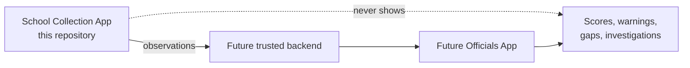

---

## 3. The problem

School records can show what was expected or reported, but they may not show
what happened on a particular day. A central team also cannot visit every class
and facility every day.

SchoolTwin tries to close that information gap by collecting several simple
observations:

- what a class monitor reports about the class;
- what a short live video shows at the requested place;
- what a privately selected student says they experienced; and
- what problems the school or a student reports.

No single channel is treated as truth. A class monitor may be coached. A video
may be staged. A student may be mistaken. An operator may omit work. The value
comes from separate channels that can later be compared by authorized people.

The current school app only collects and stores the inputs. It does not decide
whether the school is honest, effective, safe, or failing.

---

## 4. Product vision and firm boundary

The product rule is:

> **Collection mechanisms collect observations, not conclusions.**

Examples:

| The School app may record                              | The School app must not conclude    |
| ------------------------------------------------------ | ----------------------------------- |
| A student answered that water was unavailable.         | The school's water record is false. |
| A class monitor entered an approximate count.          | Attendance fraud happened.          |
| The expected Class 8A marker was seen.                 | The video is authentic.             |
| A video was recorded in one browser recording session. | Nobody edited or staged the scene.  |
| A required job was not submitted by closing time.      | The school is risky or dishonest.   |

This boundary protects the purpose of the school-facing product. It also avoids
showing a monitored school the hidden analysis that may later be used by
officials.

### What is deliberately absent

The current school app has no school score, confidence score, rank, district
comparison, fraud label, warning, investigation result, escalation flow,
inspector screen, or state dashboard.

---

## 5. School App versus Officials App

| Area                    | School Collection App                    | Future Officials App                         |
| ----------------------- | ---------------------------------------- | -------------------------------------------- |
| Main user               | School operator and invited participants | Authorized government staff                  |
| Main purpose            | Collect daily observations               | Review, compare, and act on evidence         |
| Daily work              | Yes                                      | May schedule or review it later              |
| Private student answers | Hidden from operator                     | Available only under approved access rules   |
| School scores and ranks | No                                       | Possible only with policy and careful design |
| Warnings and follow-up  | No                                       | Yes, if approved                             |
| Investigation           | No                                       | Yes, with human oversight                    |
| AI analysis             | No                                       | Possible later, as decision support          |
| Current status          | **IMPLEMENTED** prototype                | **FUTURE OFFICIALS APP**                     |

The two-app split is not just a menu choice. It is a trust boundary. School
staff should not be able to inspect private student answers or see how officials
may judge the school.

---

## 6. Deployment concept

### Current demo

**IMPLEMENTED:** The app opens directly into a fictional, pre-paired school:

- Sundarpur Government High School;
- SchoolTwin ID `ST-OD-1048`;
- Sundarpur district, Odisha;
- 684 students;
- 31 teachers; and
- 18 sections, Classes 1A through 9B.

The `/setup` route shows how future pairing might look. It is not government
login and does not prove that the device belongs to that school.

### Production idea

**PLANNED / PRODUCTION:** A field team or approved school administrator would
pair a managed device with a verified school record. The server would issue the
device a limited identity. School opening hours, time zone, sections, expected
strength, facilities, and markers would come from approved records.

### Rural operating model

A practical first rollout should use shared 8–11 inch Android tablets, a simple
charging plan, printed marker cards, printed participant passes, a protective
case, a named local helper, and a support phone process. The app should allow
work to continue during poor connectivity and upload later when a safe network
returns.

Offline upload is **not implemented** in this repository because there is no
server to upload to.

---

## 7. A day in SchoolTwin

The current school is configured for **10:00 AM to 4:00 PM** in the
`Asia/Kolkata` time zone.

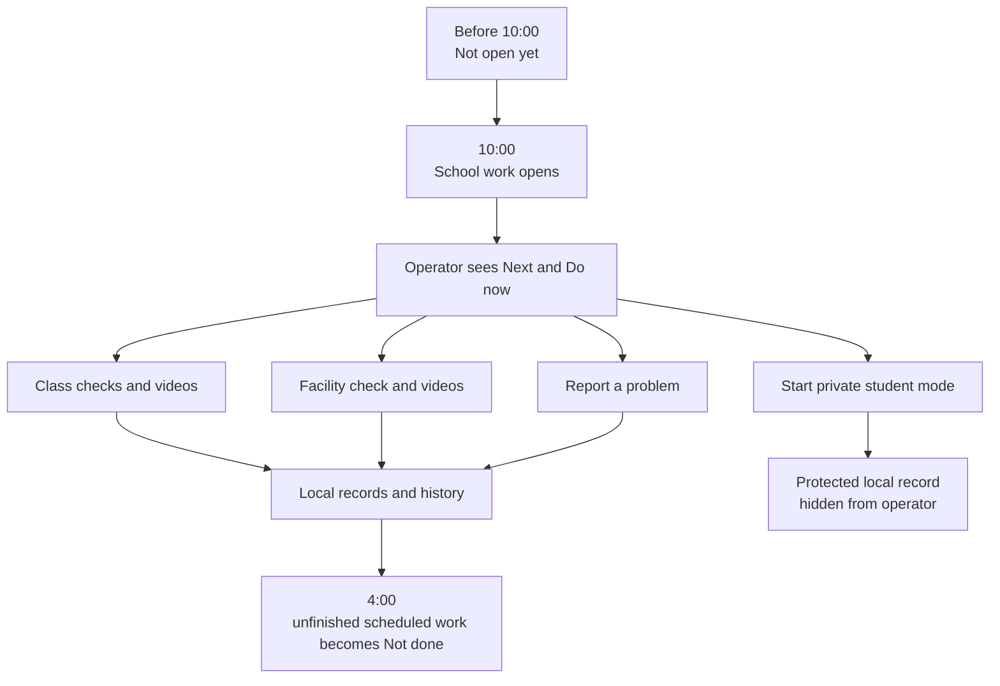

### Before school

Unfinished routine work is shown as **Not open yet**. The app does not offer a
start action.

### During school hours

Unfinished routine work is shown as **Do now**. The Home page selects one next
job, with Class 8A video used as the main demonstration job in the current seed.

### At closing

A scheduled job that was never started becomes **Not done**. This is neutral
wording. It does not accuse the school.

A job started legally before closing may finish for a short grace period.
**IMPLEMENTED code currently allows two minutes.** Some project documents say
five minutes; that difference must be fixed before relying on the rule.

### After closing

Work that was not started is not available. Work that started but did not finish
inside the grace period becomes failed. The school app still does not create a
warning or escalation.

---

## 8. Four collection channels

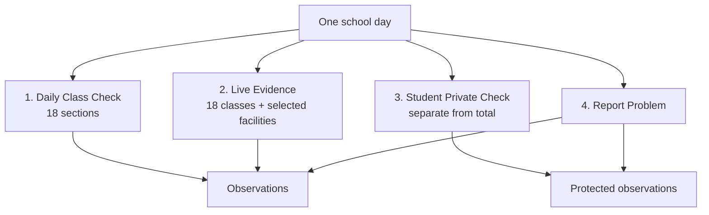

### Channel 1 — Daily Class Check

**IMPLEMENTED:** Every section receives one daily assignment and one
section-specific one-time pass. A restricted screen asks 11 short steps:

1. approximate students present;
2. whether the first-period teacher was present;
3. whether all, some, or none of the planned classes happened;
4. whether electricity was available;
5. whether fans and lights worked;
6. whether the room was usable;
7. whether drinking water was available;
8. whether toilets were available;
9. meal status;
10. any unusual condition; and
11. one seeded context question.

The attendance number must be a whole number from zero to the expected class
strength. The operator can see only that the check was submitted and when. The
operator cannot see the answers or pass.

### Channel 2 — Live Evidence

**IMPLEMENTED:** Each section has a daily video job. Selected facilities also
have video jobs. The app asks for camera permission, looks for a marker, records
one continuous 10–60 second clip, creates a SHA-256 fingerprint, and stores the
video and details in the browser.

There is no gallery upload and no pause button.

### Channel 3 — Student Private Check

**IMPLEMENTED:** A student enters a separate one-time pass and answers two simple
questions about personal experience. The current questions cover drinking water
and whether a planned mathematics class happened.

The operator sees only a broad state such as inactive, active, or completed. The
operator does not see answers, counts, sections, passes, or per-student times.

### Channel 4 — Report Problem

**IMPLEMENTED:** The school operator can send an attributed report about water,
toilets, meals, electricity, classroom, teacher, building/equipment, or another
ordinary problem.

**IMPLEMENTED:** A participant can use a restricted private-report screen after
entering a one-time pass. The report is stored without a participant reference
and is omitted from operator history.

**IMPLEMENTED:** Choosing the explicit sensitive or immediate-safety category
clears the draft and shows protected reporting guidance. The prototype does not
store that sensitive description and does not invent phone numbers.

---

## 9. Complete feature catalog

| Feature                    | User                    | What it does                                     | Why it exists                           | How it works                             | Privacy or honesty note                            | Status                    |
| -------------------------- | ----------------------- | ------------------------------------------------ | --------------------------------------- | ---------------------------------------- | -------------------------------------------------- | ------------------------- |
| Pre-paired Home            | Operator                | Opens Sundarpur without setup                    | Fast demo and low first-use burden      | Seeded browser data                      | Pairing is not verified                            | **IMPLEMENTED**           |
| Setup                      | Operator                | Shows a future pairing flow                      | Explain later onboarding                | Local demonstration page                 | Not government login                               | **PROTOTYPE-ONLY**        |
| Next job                   | Operator                | Shows one clear action                           | Reduce confusion                        | Calculated from current work             | No score or risk meaning                           | **IMPLEMENTED**           |
| Daily totals               | Operator                | Shows done and left work                         | Track completion                        | Calculated from 39 jobs                  | Operational count only                             | **IMPLEMENTED**           |
| Today's Work               | Operator                | Groups open, unopened, missed, and done jobs     | Find work quickly                       | Uses task status and school time         | Neutral missing wording                            | **IMPLEMENTED**           |
| Class matrix               | Operator                | Shows check/video status for 18 sections         | Find coverage gaps                      | Table on desktop, cards on mobile        | No class answers                                   | **IMPLEMENTED**           |
| Daily Class Check          | Class monitor           | Collects 11 section observations                 | Repeatable daily class view             | Guided form and one-time pass            | Answers hidden from operator                       | **IMPLEMENTED**           |
| Daily Facility Check       | Operator                | Collects seven facility conditions               | One daily facility overview             | Seven-step guided form                   | Attributed to school account                       | **IMPLEMENTED**           |
| Class video                | Operator                | Records a short live class clip                  | Add a visual channel                    | Camera, marker, continuous recording     | Does not prove authenticity                        | **IMPLEMENTED**           |
| Facility video             | Operator                | Records selected facility clips                  | Add visual support                      | Same capture flow                        | Can still be staged                                | **IMPLEMENTED**           |
| Marker scan                | Operator                | Checks expected place marker                     | Reduce wrong-place capture              | BarcodeDetector, ZXing, or demo fallback | A marker can be copied                             | **PROTOTYPE-ONLY**        |
| Challenge                  | Operator                | Gives capture steps and code                     | Make capture less reusable              | Generated once and stored locally        | Not issued by a server                             | **PROTOTYPE-ONLY**        |
| Video fingerprint          | System                  | Creates SHA-256 value for stored bytes           | Detect later byte changes when compared | Browser Web Crypto                       | Not proof of scene truth                           | **IMPLEMENTED**           |
| Review and retake          | Operator                | Watches clip before sending                      | Correct poor capture                    | Local object URL; retake drops old draft | User may choose best-looking take                  | **IMPLEMENTED**           |
| History                    | Operator                | Shows allowed past records by day                | Review completed work                   | Privacy-safe submission view             | Protected records excluded                         | **IMPLEMENTED**           |
| Local playback             | Operator                | Replays stored captured video                    | Confirm local retention                 | Reads video blob from IndexedDB          | Browser may clear or evict it                      | **IMPLEMENTED**           |
| Our School                 | Operator                | Shows classes and facilities                     | Find work by place                      | Seeded school map and five-day status    | No analysis or private answers                     | **IMPLEMENTED**           |
| Student Private Check      | Student                 | Asks two personal questions                      | Add a separate student voice            | Restricted screen and one-time pass      | Local device owner can still inspect data          | **PROTOTYPE-ONLY**        |
| Private report             | Student                 | Sends an ordinary private problem report         | Allow a hidden school-side channel      | Restricted screen and local record       | Hidden in UI, not guaranteed anonymous             | **PROTOTYPE-ONLY**        |
| Sensitive report handoff   | Any reporter            | Clears sensitive draft and shows guidance        | Avoid unsafe local storage              | Explicit category only                   | No verified contact route yet                      | **IMPLEMENTED**           |
| English/Odia switch        | Operator and kiosk user | Changes main labels and formatting               | Rural usability                         | Stored locale, `en-IN` or `or-IN`        | Translation is incomplete in some screens          | **IMPLEMENTED** with gaps |
| Light/Dark/System          | All users               | Changes appearance                               | Device and comfort support              | Local storage and system preference      | Not security-related                               | **IMPLEMENTED**           |
| Help & Privacy             | Operator                | Explains storage and limits                      | Honest use                              | Reads storage estimate                   | Mostly English at present                          | **IMPLEMENTED** with gaps |
| Persistent storage request | Operator                | Asks browser to reduce eviction chance           | Improve local retention                 | User presses a button                    | Browser may refuse                                 | **IMPLEMENTED**           |
| Demo Reset                 | Operator                | Clears all demo records and videos, then reseeds | Repeatable judging                      | Clears all database stores               | Keeps language; theme is separate and also remains | **IMPLEMENTED**           |
| Real backend               | System                  | Trusted issue, upload, and access control        | Production trust and scale              | Server and remote storage                | Needed for strong guarantees                       | **PLANNED / PRODUCTION**  |
| Official review and AI     | Officials               | Compare channels and find cases to review        | Turn observations into follow-up        | Separate official system                 | Must include human checks                          | **FUTURE OFFICIALS APP**  |

---

## 10. Routes and user experience

### Route map

| Route                            | Visible name or purpose | Layout           | Status                        |
| -------------------------------- | ----------------------- | ---------------- | ----------------------------- |
| `/`                              | Redirects to Home       | —                | **IMPLEMENTED**               |
| `/home`                          | Home                    | Operator         | **IMPLEMENTED**               |
| `/setup`                         | Pairing demonstration   | Operator         | **IMPLEMENTED** demo          |
| `/tasks`                         | Today's Work            | Operator         | **IMPLEMENTED**               |
| `/tasks/[taskId]`                | Work details            | Operator         | **IMPLEMENTED**               |
| `/capture/[taskId]`              | Record video            | Operator         | **IMPLEMENTED**               |
| `/facility-pulse/[assignmentId]` | Daily Facility Check    | Operator         | **IMPLEMENTED**               |
| `/submissions`                   | History                 | Operator         | **IMPLEMENTED**               |
| `/twin`                          | Our School              | Operator         | **IMPLEMENTED**               |
| `/twin/[areaId]`                 | Class or facility page  | Operator         | **IMPLEMENTED**               |
| `/report`                        | Report Problem          | Operator         | **IMPLEMENTED**               |
| `/privacy`                       | Help & Privacy          | Operator         | **IMPLEMENTED**               |
| `/pulse/[sessionId]`             | Student Private Check   | Restricted kiosk | **IMPLEMENTED**               |
| `/school-pulse/[sessionId]`      | Daily Class Check       | Restricted kiosk | **IMPLEMENTED**               |
| `/report/private/[sessionId]`    | Private report          | Restricted kiosk | **IMPLEMENTED**               |
| `/reality-check/[sessionId]`     | Old link redirect       | Restricted kiosk | **IMPLEMENTED** compatibility |

Desktop uses a narrow dark sidebar. Mobile uses five direct bottom links: Home,
Today's Work, Our School, Report Problem, and History. Help, language, and
appearance controls remain outside the main five links.

Restricted participant routes remove operator navigation, History, Our School,
and other sessions. The tablet shows a neutral private participant screen.

### Action-first design

The interface uses familiar action words instead of internal terms. Users see
“Our School,” not “Digital Twin”; “Record Class Video,” not “capture evidence
artifact”; and “Student Private Check,” not “sampling.”

The main guided forms show one question per screen, large answer buttons, a
progress count, Back, and a disabled Next button until the answer is valid.

---

## 11. Daily coverage model

### Required work

| Work type                | Required | Seeded done | Purpose                                |
| ------------------------ | -------: | ----------: | -------------------------------------- |
| Daily Class Checks       |       18 |          14 | One protected section report per class |
| Class Videos             |       18 |          12 | One live visual observation per class  |
| Daily Facility Check     |        1 |           1 | One seven-part school facility form    |
| Selected Facility Videos |        2 |           1 | Kitchen and drinking-water video jobs  |
| **Total**                |   **39** |      **28** | Daily required school work             |

During current school hours, all unfinished routine work is open together. The
current 11 unfinished items are therefore “Do now.” Before opening they are “Not
open yet.” After closing they are “Not done.”

The current seed also creates five operational school days, skipping weekends
where possible. Previous days contain neutral gaps, especially for Class 8B, so
the five-day view can show missing work without calling it risky.

### Status rules

Only these states are stored:

- scheduled;
- in progress;
- submitted;
- missed; and
- failed.

“Available” is calculated from the current time and the work window. It is not
stored, so it cannot remain stuck after the window closes.

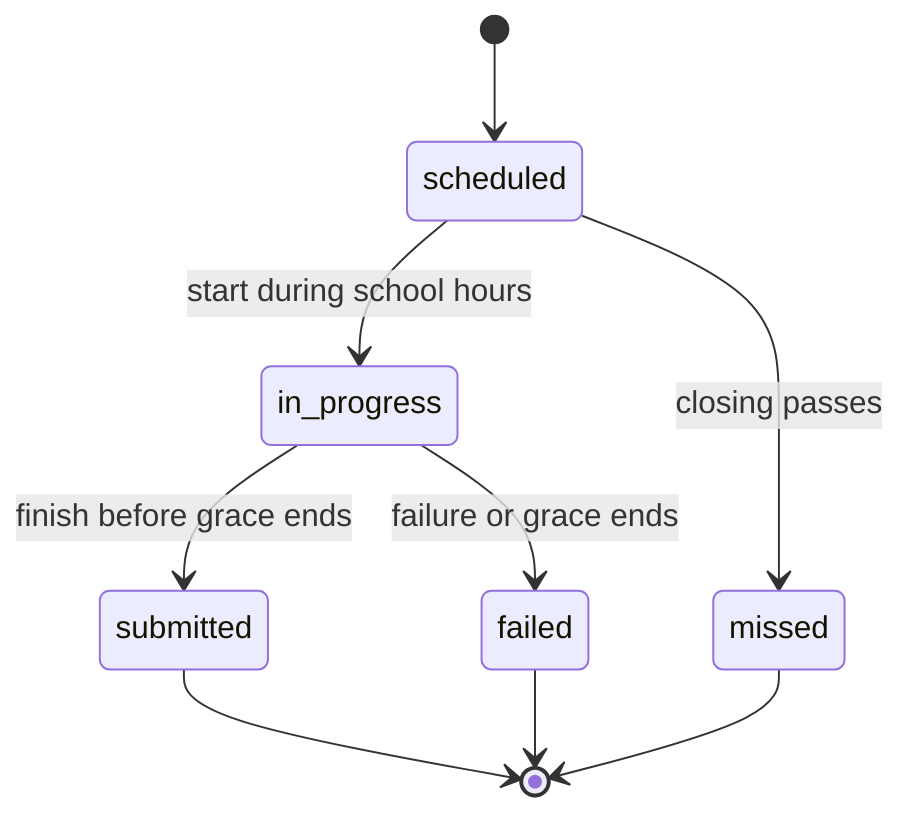

---

## 12. Our School

**IMPLEMENTED:** “Our School” is the school-side view of buildings, 18 sections,
and seven facilities. It is a practical directory, not an analysis screen.

A class page shows:

- expected student strength;
- today's Daily Class Check status;
- today's Class Video status;
- direct actions when work can start;
- five school days of submitted or missing status; and
- permitted operator history.

A facility page shows facility work and any selected video requirement.

It never shows the class monitor's answers, a private student's answers,
estimated attendance results, confidence, warnings, or school conclusions.

**Current wording gap:** Some Our School screens still contain internal phrases
such as “School Pulse,” “Attendance Evidence,” “Operational Twin,” or “permitted
submissions.” These should be replaced with the simpler public labels already
used on Home.

---

## 13. Live Evidence

### User flow

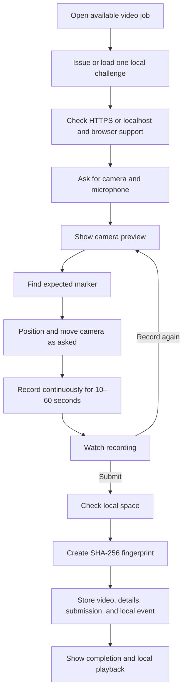

### What is checked

**IMPLEMENTED:** Before opening the camera, the app checks for a secure browser
context, camera access, `MediaRecorder`, and a supported recording type. The
supported demo target is current Chrome or Chromium on HTTPS or localhost.

The recording service asks for the back camera where available and requests
audio. It selects the first supported WebM recording type from VP9, VP8, and
plain WebM choices.

### Recording rules

- minimum: 10 seconds;
- maximum: 60 seconds;
- no pause control;
- no file or gallery input;
- visible timer and recording text;
- automatic stop at the maximum;
- review before submission;
- retake before submission; and
- final local submission.

The app limits one clip to 30 MiB and total local evidence to 150 MiB. It also
asks the browser for a space estimate before saving where available.

### Challenge

A challenge is generated once for a task, stored, and reused after refresh. It
contains a short code and capture steps. It is correctly labelled
“Prototype-issued challenge.”

**PROTOTYPE-ONLY:** The challenge is issued by local browser code, not by a
trusted server. A device owner can inspect or change it.

### Retake behavior

Before submission, the draft video exists in memory rather than the database.
Choosing “Record again” drops that draft and starts again. If an earlier stored
blob existed for the same draft key, the repository deletion path is available.
The reset tool clears every saved blob.

### Allowed claims

The app may say:

- Recorded continuously in this SchoolTwin session.
- Expected classroom marker observed.
- Local capture timestamp recorded.
- Evidence fingerprint generated.
- Prototype integrity checks completed.

It must not say “authentic,” “tamper-proof,” “server verified,” “proof of
presence,” or “impossible to manipulate.”

### Important demo seed detail

The seeded completed video jobs have Submission and local event records, but the
seed does not include actual video blobs or capture-detail records. Only a video
recorded through the live flow can be replayed. Judges may notice that old seeded
“videos” have no playback; the team should explain this or add honest demo media
before presentation.

---

## 14. Marker system

Each class or facility has an expected marker value, such as a SchoolTwin URI.
The scanner tries methods in this order:

1. the browser's `BarcodeDetector`, for up to about three seconds;
2. the ZXing browser library, for up to about eight seconds; and
3. a clearly labelled **Demo marker confirmation** button when demo fallback is
   allowed.

The marker helps reduce accidental capture of the wrong room. It does not prove
that the marker is permanently attached, that the room was not staged, or that
the device is physically at the school. A copied marker can be shown elsewhere.

**PLANNED / PRODUCTION:** Use managed, hard-to-copy physical labels, server-held
marker records, short official capture windows where justified, device checks,
and later review of the whole scene. Even then, a marker is one signal, not proof.

---

## 15. Video fingerprint

The app creates a SHA-256 value from the exact video bytes. This value is called
an **evidence fingerprint**.

If the video bytes change, a new SHA-256 value will almost certainly be
different. That makes the value useful for comparing a later file with the file
that was first saved.

It does not show:

- who recorded the video;
- where it was recorded;
- whether the scene was staged;
- whether the local clock was correct;
- whether someone controlled the browser before submission; or
- whether the people shown belong to that class.

Because both the video and fingerprint are local, a device owner can replace
both. Production needs the server to receive and bind the original upload,
trusted time, challenge, device session, and fingerprint.

---

## 16. Student Private Check

### Purpose

The Student Private Check asks, “What did you personally experience?” It is not
the same as the class monitor's section-level check.

### Current journey

1. The operator selects **Start Student Mode**.
2. Operator navigation disappears.
3. The student enters a one-time prototype pass.
4. The pass is checked for the correct session, expiry, and prior use.
5. The student answers one question per screen.
6. The answers are stored only at final submission.
7. The pass is consumed and the session is locked.
8. A neutral “Thank you; hand the device back” screen appears.

If the page refreshes after the pass is accepted, the student does not need to
enter it again. The questions restart at question one. Partial answers are not
saved.

### What the operator sees

At most, the operator sees a broad state: inactive, active, or completed. The
operator does not see the number of students, section, individual time, pass,
or answers.

### Current privacy truth

The normal operator screens hide the answers. However, the raw answers remain in
the browser database. A person with control of the device and developer tools
can inspect them. This is modeled privacy, not guaranteed anonymity.

---

## 17. Student Access Grants

The code calls the one-time participant pass an `AccessGrant`. In user-facing
text, **one-time pass** is usually clearer.

An Access Grant is separate from the private screen session:

- the session says which restricted workflow is open on the device;
- the grant says that one participant may enter that workflow once.

The stored grant contains a hash of the pass, not the plain pass. It is limited
to one session type, may be tied to a section, expires, and records whether it
has been used.

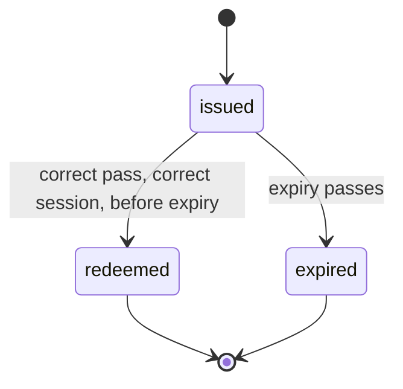

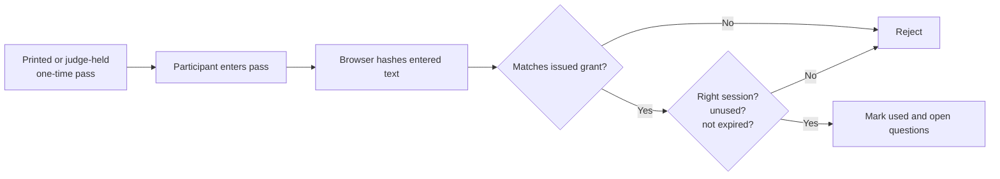

### Demo delivery

Valid demo passes do not appear in normal operator navigation. They are listed
in `docs/demo-runbook.md` for the team or can be printed as judge cards.

### Can a teacher use a student pass?

Yes. The current frontend cannot know who typed a pass. Hashing stops casual
reading of plain passes from the grant store, but it does not prove student
identity. A teacher who obtains a valid unused pass can use it.

The frontend currently reduces reuse by making each pass single-use and short-
lived. It does not stop theft, pressure, copying before use, or a teacher
pretending to be a student.

### Recommended production design

Use a mix of controls rather than one perfect code:

- server-issued, short-lived passes;
- random selection that the school cannot predict far in advance;
- sealed printed cards or rotating QR cards held by students or a trusted field
  process;
- visible one-use status without exposing the answer;
- rate limits and duplicate checks;
- a separate official sampling plan;
- safe ways for students to decline;
- periodic field checks; and
- strict rules against retaliation.

Government-issued rotating student cards can work where card handling is
realistic. Scratch codes can reduce advance copying but create supply work.
Rotating QR tokens are easier to scan but need careful printing and replacement.
Field-worker enrollment provides stronger setup but costs more. A pilot should
test the simplest safe option rather than assume one design fits every school.

### Physical pressure cannot be solved by code alone

A teacher can still pressure a student to answer in a certain way. Production
must protect the setting around the check: private space, unpredictable
selection, clear no-retaliation policy, safe complaints, official follow-up,
and data grouping that avoids revealing a small group or individual.

---

## 18. Privacy model

### Visibility table

| Information                                | School operator                 | Participant screen       | Future authorized officials | Current raw browser owner                     |
| ------------------------------------------ | ------------------------------- | ------------------------ | --------------------------- | --------------------------------------------- |
| Daily job status                           | Yes                             | Only current workflow    | Planned                     | Can inspect                                   |
| Class Check answers                        | No                              | During current form only | Planned, controlled         | Can inspect local database                    |
| Class monitor pass                         | No                              | Entered then cleared     | Server control planned      | Plain seed pass exists in runbook, hash in DB |
| Student Private answers                    | No                              | During current form only | Planned, controlled         | Can inspect local database                    |
| Student count or section for private check | No                              | No                       | Sampling policy later       | Current seed/session may be inspected         |
| Private report text/category/time          | No                              | Current flow only        | Planned                     | Can inspect local database                    |
| Operator report                            | Yes                             | No                       | Planned                     | Can inspect                                   |
| Submitted video                            | Yes in History if a blob exists | No                       | Planned                     | Can inspect/delete                            |
| Fingerprint                                | In technical details            | No                       | Planned                     | Can replace with file                         |
| Official scores/warnings                   | No                              | No                       | Future                      | Not present                                   |

### Privacy projections

React screens do not read the database directly. The repository converts raw
records into smaller, safe views first.

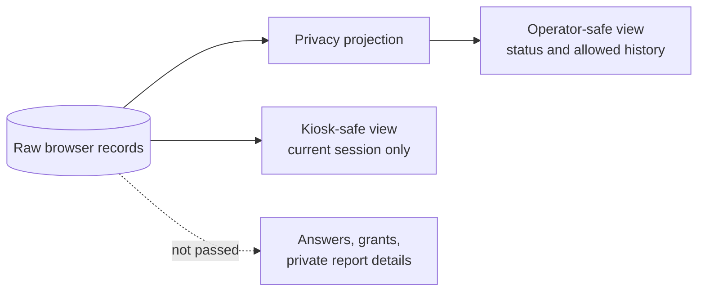

This is a good design boundary and can be reused with a future server. It is not
a device security boundary because the raw records still exist locally.

### Sensitive reports

Only choosing the explicit sensitive category starts the protected flow. The
app does not scan free text with AI. This avoids false guesses. It also means a
person could type sensitive content under an ordinary category and the local
app would store it. Clear instructions and trained support are needed.

---

## 19. User permissions

| Action                               |     Operator     |    Class monitor     |       Student        |   Future official    |
| ------------------------------------ | :--------------: | :------------------: | :------------------: | :------------------: |
| See today's school work              |       Yes        |          No          |          No          |       Planned        |
| Start class video                    |       Yes        |          No          |          No          |  May schedule later  |
| Complete Daily Facility Check        |       Yes        |          No          |          No          |     Review later     |
| Open restricted class session        |       Yes        |  Uses after handoff  |          No          |   May issue later    |
| Enter Class Check answers            |    Should not    |         Yes          |          No          |          No          |
| Enter Student Private answers        |        No        |          No          |         Yes          |          No          |
| See private answers                  |        No        |   No after submit    |   No after submit    |   Controlled later   |
| Send operator report                 |       Yes        |          No          |          No          |     Review later     |
| Send private report                  | Must not inspect | Possible participant | Possible participant |   Controlled later   |
| See operator-safe History            |       Yes        |          No          |          No          | Planned broader view |
| Reset demo                           |  Yes, demo only  |          No          |          No          |          No          |
| See scores, warnings, investigations |        No        |          No          |          No          |     Future only      |

These are UI and repository rules in the prototype. They are not backed by
production login or server permission checks.

---

## 20. Anti-manipulation approach

SchoolTwin does not claim to stop all manipulation. It makes manipulation harder
and easier to notice later by collecting different signals.

### Current prototype signals

- one-time participant passes;
- separate restricted screens;
- no gallery video input;
- no recording pause control;
- one continuous browser recording session;
- expected marker check;
- one saved challenge per task;
- local start/end time and duration;
- video byte count and type;
- SHA-256 fingerprint;
- separate class, video, student, and report channels;
- local event records; and
- missing-work status.

### Why several channels are stronger

A teacher may influence a class check, but may not control every private student
answer. A student may be wrong, but the video and facility report may add
context. A staged video may look normal, but repeated missing records or other
channels may deserve review.

**FUTURE OFFICIALS APP:** Only authorized officials should compare these signals
and decide whether a human review is needed. AI may help sort cases, but should
not declare truth or punish a school.

---

## 21. Threat model

| Threat                              | Current effect                     | Current response                       | Remaining risk                          | Practical production fix                                         |
| ----------------------------------- | ---------------------------------- | -------------------------------------- | --------------------------------------- | ---------------------------------------------------------------- |
| Teacher changes Class Check answers | False section report               | Restricted screen and one-use pass     | Teacher may get or control pass         | Server-issued random pass, private handoff, audits, field checks |
| Teacher uses student pass           | False private answer               | Hash, expiry, single use               | No identity proof                       | Safer pass delivery, random sample, field support, rate rules    |
| Teacher pressures student           | Coerced answer                     | Operator cannot see normal answer view | Physical pressure remains               | Private setting, no-retaliation policy, safe official follow-up  |
| Monitor is coached                  | Repeated false observations        | Protected answers, separate channels   | Coaching remains possible               | Rotate monitors, compare channels, official sampling             |
| School stages classroom             | Misleading scene                   | Live in-app capture and challenge      | Scene can still be staged               | Short server windows, varied challenges, independent visits      |
| Students moved between rooms        | Misleading video                   | Marker and continuous pan              | Marker does not prove roster            | Server schedule, multiple timed views, human review              |
| Old video replay                    | Reused media                       | No gallery input; camera recording     | Virtual camera/browser control possible | Managed device, server challenge, device checks                  |
| Pre-recorded gallery upload         | Reused media                       | No file input                          | Browser can be modified                 | Managed signed app/device and server checks                      |
| Wrong classroom                     | Wrong place recorded               | Expected marker scan                   | Marker can be moved/copied              | Fixed managed marker plus scene review                           |
| Marker spoofing                     | Fake location signal               | Exact expected value check             | Copy is easy                            | Signed rotating marker plus managed setup                        |
| Browser tool changes                | Local rules bypassed               | No strong prevention                   | Device owner controls app               | Managed kiosk, server authorization, signed releases             |
| Database edited                     | Status/answers changed             | Typed repository and projections       | IndexedDB remains editable              | Server database, write rules, append-only server events          |
| Local clock changed                 | Wrong availability/time            | Central Clock adapter in code          | System time is still local              | Trusted server time and signed issuance                          |
| Browser clears video                | Evidence disappears                | Persistence request and reset warning  | Browser may evict data                  | Remote upload with retry and checks                              |
| Shared device compromised           | Private data exposed               | Restricted screens                     | Raw database can be inspected           | Managed profiles, encryption, short local retention              |
| Many fake reports                   | Noise                              | One-use private session in demo        | Local sessions can be edited            | Server rate limits, issue controls, review queue                 |
| Student gives false answer          | Bad input                          | Simple questions and separate channels | No direct truth test                    | Pattern review, sample size, human follow-up                     |
| Operator withholds work             | Missing data                       | Not done status                        | No external alert                       | Server heartbeat and official missing-work review                |
| Facility is staged                  | Misleading check/video             | Facility form plus selected video      | Temporary cleanup possible              | Varied timing, maintenance records, visits                       |
| No internet                         | Cannot upload in production design | Current demo is local                  | No remote copy                          | Offline queue, clear sync state, retry                           |
| Power or camera failure             | Work cannot complete               | User-facing errors                     | No spare device plan                    | Charging, spare device, support process                          |
| QR scan fails                       | Workflow blocked                   | ZXing then labelled demo fallback      | Demo fallback is weak                   | Better markers, tested camera, controlled manual exception       |
| Pass is lost                        | Student cannot enter               | No recovery in normal UI               | Demo needs runbook reset                | Server revoke/reissue without revealing answer                   |
| Retaliation                         | Student harm                       | Operator view hides content            | Timing/context may still identify       | Delayed/grouped disclosure, official-only handling, policy       |
| Small group identification          | Privacy loss                       | Operator sees no private details       | Officials may infer identity later      | Minimum group sizes and strict access rules                      |
| Language confusion                  | Wrong answers                      | English/Odia and guided screens        | Translation gaps remain                 | Fluent review, device test, icons, training                      |

---

## 22. Product loopholes

| Loophole                                                                | Why it matters                                | Suggested fix                                                                | Priority                |
| ----------------------------------------------------------------------- | --------------------------------------------- | ---------------------------------------------------------------------------- | ----------------------- |
| A teacher can obtain and use a participant pass                         | Private input may not be from a student       | Trusted pass delivery and random selection                                   | Critical for production |
| A participant can be pressured                                          | Code cannot create a safe room                | No-retaliation policy and private setting                                    | Critical                |
| A classroom or facility can be staged                                   | Live video is still a chosen moment           | Varied server-issued tasks and field visits                                  | High                    |
| Class monitor answers may be coached                                    | One voice may reflect school pressure         | Rotate participants and compare channels                                     | High                    |
| The operator may skip work                                              | Local app has no outside alert                | Server missing-work monitor                                                  | High                    |
| Private report may include sensitive text under an ordinary category    | Sensitive text can be stored locally          | Clear copy, safe review rules, protected production route                    | High                    |
| Two private questions may be too narrow                                 | Student channel may miss key issues           | Carefully varied approved questions                                          | Medium                  |
| Facility form is operator-attributed                                    | It is not independent evidence                | Combine with video, student input, and visits                                | Medium                  |
| Old seeded video records have no playable file                          | Demo may look incomplete                      | Record real demo clips or label seeded records                               | Demo high               |
| Fixed school hours may not fit every day                                | Holidays and changed hours cause wrong status | Server calendar and local exceptions                                         | Production medium       |
| “No video required” can look like “Not open yet” on some facility pages | User may think work is blocked                | Add a clear no-video-required state                                          | UX medium               |
| Full answers hidden from the operator may reduce correction ability     | Honest mistakes cannot be reviewed locally    | Controlled correction window through officials, never reveal private answers | Policy medium           |

---

## 23. Technical loopholes

| Loophole                                                             | Evidence in current design                                              | Risk                                          | Fix                                                                 |
| -------------------------------------------------------------------- | ----------------------------------------------------------------------- | --------------------------------------------- | ------------------------------------------------------------------- |
| All trust is local                                                   | IndexedDB, local clock, local grants                                    | Device owner can change data                  | Move trust to server                                                |
| Grant redemption can race                                            | Read and write are not one strict compare-and-set operation             | Two very close calls may both pass            | Atomic server transaction and unique rule                           |
| Multi-record submissions are not one transaction                     | Response, assignment, submission, event, and session are saved in steps | A crash can leave half-finished state         | Repository method with one DB transaction; server transaction later |
| Student response duplicate guard is weaker than class response guard | Session normally prevents repeats, raw call can still write             | Local manipulation or duplicate data          | Enforce one response per session in store/server                    |
| Local events are editable                                            | `audit_events` is IndexedDB                                             | Not an audit guarantee                        | Append-only server events with access controls                      |
| Local time controls task state                                       | Browser system clock feeds `Clock`                                      | User can open or close work by changing time  | Server time and signed windows                                      |
| Manual demo marker fallback is enabled                               | Config allows it                                                        | Location check can be skipped                 | Disable outside demo builds                                         |
| WebM choices may not fit every browser/device                        | Media types are Chrome-focused                                          | Capture failure elsewhere                     | Keep Chrome support statement; field-test target device             |
| Browser storage can be evicted                                       | IndexedDB is not permanent                                              | Lost evidence                                 | Immediate remote upload and retry queue                             |
| Persistent storage requires a user action                            | Privacy page has a request button                                       | It may never be requested                     | Ask during setup with clear consent/status                          |
| Object URLs need careful cleanup                                     | History creates local playback URLs                                     | Long sessions may waste memory                | Revoke URLs on unmount/change                                       |
| School time zone use is not fully central                            | Some queries/formatting use Asia/Kolkata directly                       | Future schools in other zones may be wrong    | Pass school time zone everywhere                                    |
| Translation coverage is incomplete                                   | Many strings are hard-coded English                                     | Odia flow can become mixed-language           | Move all primary text into typed dictionary                         |
| Odia font package is not downloaded                                  | App relies on system fallbacks                                          | Some devices may render poorly                | Bundle a tested Odia-capable font if license allows                 |
| E2E camera is mocked                                                 | Playwright uses a fake `MediaRecorder`                                  | Tests do not prove real camera behavior       | Add target-device manual test and browser lab test                  |
| No production content security policy is documented                  | Frontend-first demo                                                     | Browser injection risk is not fully addressed | Add secure headers, dependency review, and deployment hardening     |

---

## 24. Prototype safeguards and production fixes

| Area              | Current safeguard                 | What it really provides                   | Production replacement                      |
| ----------------- | --------------------------------- | ----------------------------------------- | ------------------------------------------- |
| Participant pass  | Hash, scope, expiry, one use      | Reduces casual reuse                      | Server-issued pass and atomic redemption    |
| Restricted screen | No operator menu                  | Reduces accidental exposure               | Server roles plus managed kiosk             |
| Video source      | Camera only in normal UI          | Blocks ordinary gallery selection         | Managed device and server challenge         |
| Recording         | No pause, 10–60 seconds           | One browser recording session             | Signed task, upload stream, server checks   |
| Marker            | Expected value and fallback chain | Reduces wrong-room mistakes               | Managed marker and official setup           |
| Challenge         | One local saved challenge         | Stable demo flow                          | Fresh server-issued challenge               |
| Fingerprint       | Local SHA-256                     | Identifies exact saved bytes              | Server binds fingerprint to upload and time |
| Time              | Local ISO timestamps              | Useful demo record                        | Trusted server time                         |
| Storage           | IndexedDB and persistence request | Refresh/relaunch survival in normal cases | Remote object storage and offline queue     |
| Privacy           | Safe view objects before UI       | Stops ordinary operator screen exposure   | Server row/field permissions and policy     |
| Events            | Local event store                 | Useful debugging/history                  | Protected server event trail                |
| Reset             | Clears all stores/blobs           | Repeatable demo and deliberate deletion   | Admin retention and deletion policy         |

---

## 25. Data and domain design

### Main records

| Record                         | Plain meaning                                        |
| ------------------------------ | ---------------------------------------------------- |
| `School`                       | School identity, time zone, hours, and counts        |
| `SchoolArea`                   | Building, classroom, or facility                     |
| `Section`                      | One class section and expected strength              |
| `SchoolPulseDay`               | One operational school day                           |
| `ClassPulseAssignment`         | One section's Daily Class Check job                  |
| `ClassPulseSession`            | Restricted device session for that check             |
| `ClassPulseResponse`           | Protected section answers                            |
| `FacilityPulseAssignment`      | Daily Facility Check job                             |
| `FacilityPulseResponse`        | Seven attributed facility answers                    |
| `StudentPulseSession`          | Restricted Student Private Check session             |
| `StudentPulseResponse`         | Protected personal answers                           |
| `VerificationTask`             | Live class or facility video job                     |
| `TaskChallenge`                | Saved local capture steps and code                   |
| `AccessGrant`                  | Hashed, limited, one-time participant pass           |
| `IncidentReport`               | Operator or private ordinary problem report          |
| `CaptureArtifact`              | Video details and fingerprint                        |
| `Submission`                   | Completion record with operator/protected visibility |
| `AuditEvent`                   | Local workflow event; not immutable                  |
| `SectionCoverageHistoryRecord` | Neutral five-day class status                        |
| `PrototypeStorageStatus`       | Whether browser persistence was requested/granted    |

Legacy Class Reality Check records are kept as read-only “Legacy class
observation” records. New class work uses the Class Check records.

### Session states

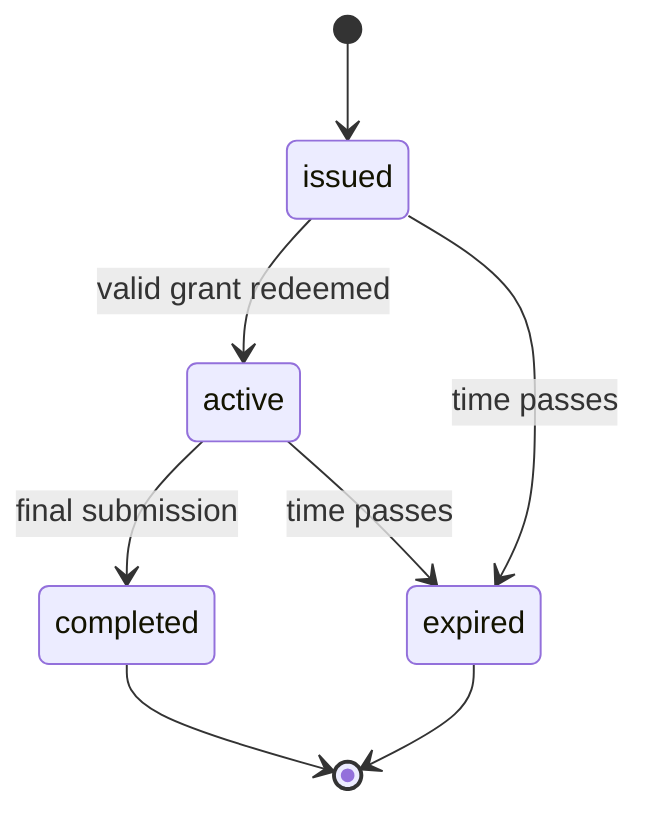

### Capture screen states

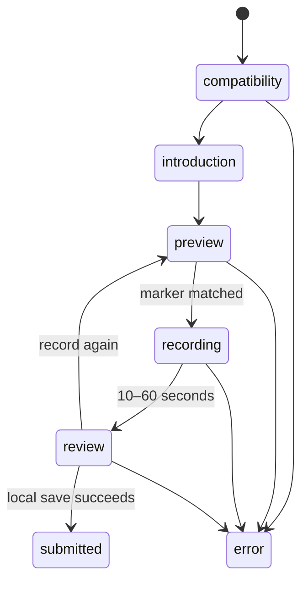

---

## 26. Repository design

Product screens use a `SchoolTwinRepository` interface. They do not call
IndexedDB directly. This keeps storage details out of the user interface and
makes a future server-backed repository possible.

The code also has replaceable helpers:

| Helper                | Job                                      | Current implementation           |
| --------------------- | ---------------------------------------- | -------------------------------- |
| `Clock`               | Supplies current time                    | Browser/system time              |
| `IdGenerator`         | Creates record IDs                       | Browser crypto UUID              |
| `EntropySource`       | Supplies random bytes                    | Browser crypto random values     |
| `ChallengeGenerator`  | Creates task challenge                   | Local generator                  |
| `CaptureService`      | Opens camera and records                 | `getUserMedia` + `MediaRecorder` |
| `MarkerScanner`       | Reads expected marker                    | BarcodeDetector + ZXing          |
| `BlobHasher`          | Creates SHA-256                          | Web Crypto                       |
| `StorageQuotaService` | Estimates space and asks for persistence | Browser Storage API              |
| `TaskIssuer`          | Gets current tasks                       | Local repository                 |

This separation is a strong technical choice. Replacing the current local
helpers with server-backed versions should not require a full user-interface
rewrite.

---

## 27. Browser storage and versioning

The app uses IndexedDB through the `idb` library. The database is named
`schooltwin-prototype` and is currently version 5.

### Stores

Structured data stores include metadata, schools, areas, sections, tasks,
challenges, sessions, access grants, submissions, local events, student
responses, legacy observations, incident reports, capture details, Pulse days,
class assignments/responses, facility assignments/responses, and five-day
history. Video bytes live in the separate `capture_blobs` store.

### Upgrades

The adapter has explicit upgrades from version 1 through version 5. The v3 to
v5 test checks that old records remain while newer daily coverage records are
added. The database is not deleted merely because the record shape changes.

### Retention statement

Captured evidence is retained locally in the current browser profile and is
expected to survive normal refresh or relaunch during the prototype, unless
browser storage is manually cleared or evicted.

The Help & Privacy page lets the operator ask the browser for persistent
storage. The browser may grant or refuse it. The request is not automatic.

### Demo Reset

Demo Reset:

- asks for confirmation;
- clears every structured store;
- clears all video blobs;
- clears challenges, sessions, passes, reports, and local events;
- restores the same Sundarpur scenario with dates tied to the current clock;
- preserves the chosen language; and
- returns to Home.

Appearance also remains because it is stored separately in browser local
storage and Reset does not remove it.

---

## 28. Technology stack

Versions below come from the current repository files.

| Area                 | Current technology and version                                                     |
| -------------------- | ---------------------------------------------------------------------------------- |
| Framework            | Next.js 16.3.0, App Router                                                         |
| User interface       | React and React DOM 19.x                                                           |
| Language             | TypeScript 5.7.3, strict typing                                                    |
| Styling              | Tailwind CSS 4.3.3 and CSS design tokens                                           |
| UI building blocks   | Base UI 1.5.0, shadcn 4.8.0, local components                                      |
| Icons                | Lucide React 1.16.0                                                                |
| Browser database     | IndexedDB through `idb` 8.0.3                                                      |
| Marker fallback      | `@zxing/browser` 0.1.5                                                             |
| Unit/component tests | Vitest 4.1.x, React Testing Library 16.3.2                                         |
| Browser tests        | Playwright 1.62.1, Chromium project                                                |
| Browser APIs         | MediaDevices, MediaRecorder, Web Crypto, Storage API, BarcodeDetector when present |
| Fonts                | Geist Sans/Mono plus system Odia fallbacks                                         |
| Language system      | Typed English/Odia dictionary plus `Intl` with `en-IN`/`or-IN`                     |
| Appearance system    | Light, dark, or device setting in local storage                                    |
| Package manager      | pnpm 11.19.0                                                                       |
| Analytics            | Vercel Analytics 1.6.1 in production builds                                        |

---

## 29. Current implementation limits

> **Important: this is a frontend-first hackathon prototype.**

That means:

- data stays in one browser profile;
- there is no trusted remote authority;
- there is no production login;
- passes are checked locally;
- timestamps can be changed with the device clock;
- browser data can be inspected or edited by the device owner;
- video authenticity cannot be proven;
- the marker does not prove location;
- private views do not guarantee anonymity against the device owner;
- local events are not immutable;
- browser storage can be cleared or evicted;
- the camera browser tests use a mock, not real target hardware; and
- there is no Officials App or AI analysis in this repository.

These are not small-print exceptions. They define what the current demo is and
is not.

---

## 30. Future production architecture

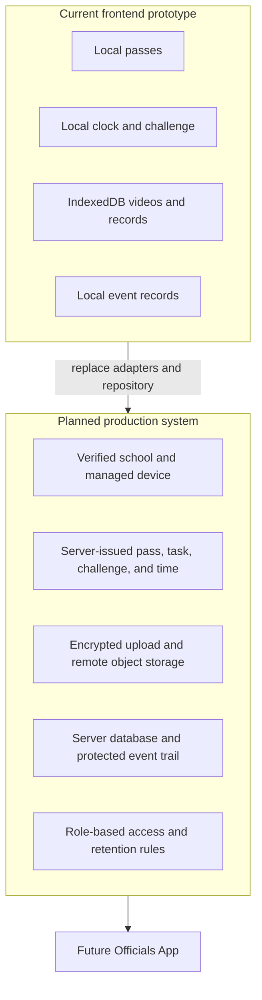

Recommended production parts:

1. a verified school registry and device enrollment;
2. secure school, participant-session, and official access;
3. a server database such as PostgreSQL;
4. remote video storage with upload checks and retention policy;
5. server-issued tasks, passes, challenges, and trusted time;
6. an offline queue with clear pending/sent/failed states;
7. field support and device replacement;
8. protected access logs and deletion workflows;
9. policy-approved student privacy and child-safety routes; and
10. a separate Officials App.

### Initial school map creation

A production school map should come from approved school records and a field
setup visit. The setup team should confirm buildings, sections, expected
strength, facilities, school hours, marker placement, device ownership, and a
local support contact. The school may suggest corrections, but approved changes
should be reviewed outside the ordinary daily operator screen.

---

## 31. Future Officials App and AI

The future Officials App may receive school observations, private student input,
official visits, staffing records, schedules, past work, and other approved
sources. It may help authorized staff find missing or conflicting information.

Possible later functions:

- compare repeated observations over time;
- find missing daily coverage;
- find unusual differences between channels;
- group cases for human review;
- summarize long histories;
- suggest questions for an investigator; and
- track approved follow-up actions.

AI should not be described as verifying truth. It can rank or summarize signals,
but a human must review important cases. Models can be wrong, biased, or misled.
The system should record what data and rule led to a suggestion, allow appeal and
correction, and avoid automatic punishment.

The school-facing app must not show these hidden conclusions.

---

## 32. Rural use and accessibility

### Current strengths

- one obvious next action on Home;
- large touch controls;
- one question per guided screen;
- mobile bottom navigation;
- desktop sidebar;
- visible keyboard focus;
- text labels as well as color;
- reduced-motion support;
- responsive class matrix cards;
- English and Odia setting;
- light, dark, and device appearance;
- simple school-side labels; and
- kiosk screens without distracting menus.

### Current gaps

The English/Odia dictionary itself is complete for its listed keys, but many
screens still contain hard-coded English. Setup, Help & Privacy, History,
technical capture messages, private reporting, some error messages, and parts
of Our School can become mixed-language.

Odia uses system font fallbacks such as Noto Sans Oriya/Odia and Kalinga. The
repository does not prove that the actual demo Android and Windows devices have
good glyph coverage.

The runbook still has blank places for the tested Android device, Windows
device, browser version, font result, and unbriefed user test. Those checks must
be completed by people on the physical devices.

### Required unbriefed test

Give the target tablet to a person who has not heard the product explanation and
say:

> “Aaj Class 8A ka kaam karna hai. App use karke karo.”

They should reach **Class 8A → Record Class Video → Record now** without being
taught words such as evidence, collection, Pulse, or Digital Twin. Record any
pause or question and fix the blocking wording before the demo.

---

## 33. Complete user journeys

### School operator

1. Open Home.
2. Check done and left totals.
3. Use the Next card.
4. Complete videos and the Facility Check.
5. Hand the device to invited participants on a restricted screen.
6. Send ordinary school-account problem reports.
7. Review permitted History.
8. Use Our School to find class or facility work.

### Class monitor

1. Receive an approved one-time class pass.
2. Use the restricted Daily Class Check screen.
3. Enter the pass.
4. Answer 11 section questions.
5. Submit once.
6. Hand the device back after the neutral completion screen.

### Student Private Check

1. Receive a separate one-time pass.
2. Enter Student Mode with no operator menu.
3. Answer two personal questions.
4. Submit once.
5. Hand the device back.

### Private report

1. Open the restricted private-report session.
2. Enter the correct one-time pass.
3. Choose an ordinary problem category.
4. Write what happened and submit.
5. The operator History does not show its text, category, or time.

If the sensitive category is chosen, the draft is cleared and not saved.

### Live class or facility video

1. Open an available video job.
2. Start the camera.
3. Read the saved prototype challenge.
4. scan the expected marker or use the labelled demo fallback;
5. move the camera as asked;
6. record 10–60 continuous seconds;
7. watch, record again, or submit;
8. save locally and return to Today's Work.

### History review

Operator-safe records are grouped as Today, Yesterday, and localized older
dates. Video playback and fingerprint details are placed inside expandable
controls. Protected student work is absent.

### Demo Reset

Open History, expand Demo tools, confirm Reset, and return to a freshly seeded
Home. All locally captured evidence is deleted.

---

## 34. Hackathon demonstration

### Suggested 6–8 minute flow

1. Open Home and say: “This is the school app, not the officials' analysis
   app.”
2. Point to **28 of 39 checks done** and the Class 8A next action.
3. Open Class 8A video, start the mocked or real camera, show the challenge,
   confirm the marker, record continuously, submit, refresh, and replay.
4. Open the Class 8A Daily Class Check using the printed demo pass. Complete a
   few steps or use a prepared flow. Show that reusing the pass is rejected.
5. Start Student Private Check. Show that operator menus disappear and answers
   do not appear in History.
6. Send an operator report, then a private report. Show only the operator report
   in History.
7. Open Our School and Class 8A. Show today's pair and five neutral school days.
8. Open Help & Privacy. State the local-storage and authenticity limits plainly.
9. End with the future server and Officials App diagram, not with unsupported AI
   claims.

### Judge-facing explanation

> SchoolTwin does not ask a monitored school to judge itself. It asks the school
> to complete clear daily collection work. Class checks, live videos, private
> student input, and reports are separate observation channels. The current
> frontend proves the workflow and privacy-aware interface. Production moves
> identity, timing, issue, storage, and access to a trusted backend. A separate
> Officials App can then compare signals with human oversight.

### If asked, “How do you know the video is real?”

> This frontend does not claim to prove physical authenticity. It demonstrates
> live in-app recording, no gallery upload, a local challenge, marker checking,
> continuous capture, local time, and a file fingerprint. Production would add
> server-issued work, trusted time, managed devices, immediate remote upload,
> and independent review. These controls reduce manipulation; they do not make
> any one video unquestionable truth.

---

## 35. Hackathon readiness assessment

| Area                   | Score / 10 | Evidence-based view                                                   |
| ---------------------- | ---------: | --------------------------------------------------------------------- |
| Problem clarity        |        9.0 | Strong need and easy daily-work story                                 |
| Product boundary       |        9.0 | School and official roles are clearly separated                       |
| Social value           |        8.5 | Could improve visibility if deployed safely                           |
| Daily user experience  |        7.5 | Action-first flow is strong; mixed-language/internal wording remains  |
| Technical depth        |        8.0 | Versioned database, adapters, camera, hashing, tests                  |
| Privacy design         |        8.0 | Good view separation; raw local data is still exposed to device owner |
| Anti-manipulation      |        6.0 | Good signals for a demo; no trusted backend/device                    |
| Demo reliability       |        7.0 | Automated flow is broad; real hardware evidence is missing            |
| Production feasibility |        6.5 | Clear path, but large field and policy work remains                   |
| Scale readiness        |        5.0 | No server, sync, identity, fleet, or support system                   |
| AI readiness           |        5.0 | Good future inputs, but no Officials App or model pipeline            |
| **Overall**            |    **7.2** | Strong hackathon prototype with honest limits                         |

### Strongest parts

- a clear “do the next job” experience;
- firm school/official separation;
- four observation channels;
- privacy-safe operator views;
- honest capture wording;
- versioned local storage;
- broad automated tests; and
- a credible replacement path to a server.

### Weakest parts

- no trusted backend or production identity;
- no real anonymity against device control;
- no target-hardware test record;
- incomplete Odia coverage;
- local clock and editable browser database;
- mock camera in end-to-end tests; and
- some demo records that claim submitted video work without a video blob.

### Top five must-fix items before the demo

1. Test the full camera, marker, recording, refresh, and playback flow on the
   exact Android tablet and Windows/Chrome setup over HTTPS or localhost.
2. Finish a fluent Odia review and remove mixed English from every screen shown
   in the demo.
3. Resolve the two-minute versus five-minute grace-period mismatch in code,
   architecture, runbook, and spoken demo explanation.
4. Decide how seeded completed video jobs will be presented when they have no
   stored clip; use real demo captures or clearly label seed-only history.
5. Rehearse the honest security answer, printed pass handoff, Reset, camera
   permission recovery, storage warning, and a backup demo recording/device.

### Nice to have before the demo

- replace remaining internal words on Our School and History;
- show “No video required” for facilities without a video job;
- add a clear submitting state to prevent fast repeat taps;
- revoke old playback object URLs; and
- record the unbriefed usability test in the runbook.

### Do not build before the hackathon

- Officials App;
- AI fraud or truth detector;
- rankings and scores;
- face recognition;
- student recognition from video;
- real government integrations;
- a rushed production login system; or
- a large analytics dashboard.

---

## 36. Minimum sufficient hackathon scope

| Level           | Items                                                                                                                                                                                                                 |
| --------------- | --------------------------------------------------------------------------------------------------------------------------------------------------------------------------------------------------------------------- |
| **MUST work**   | Home totals and Class 8A next job; real or stable camera demo; marker/fallback; 10-second recording; submit, refresh, replay; Class 8A pass; private check isolation; report privacy; Reset; honest limitation answer |
| **SHOULD work** | Odia switch; dark mode; mobile navigation; Facility Check; five-day class view; storage status; permission-denied recovery                                                                                            |
| **OPTIONAL**    | Multiple real class videos; polished printed participant cards; extra device sizes; recorded backup walkthrough                                                                                                       |
| **DEFER**       | Server, remote upload, official analysis, AI, ranking, biometrics, production identity, government data links                                                                                                         |

---

## 37. Actual code and document differences

These are not theoretical risks. They were found while comparing current code,
tests, and project documents.

1. **Grace period:** `lib/schooltwin/domain/config.ts` uses two minutes. Some
   architecture text, the runbook, and project rules describe five minutes.
2. **Database version:** Current code is version 5. Older migration prompts and
   parts of the historical plan stop at version 4.
3. **Home description:** The current Home is action-first and does not show the
   18-row matrix. Some runbook text still describes the older matrix-led Home.
4. **Visible names:** Current navigation says Today's Work and Our School. Some
   documents still use Today's Collection or Operational Twin.
5. **Language coverage:** Typed dictionary keys have English and Odia entries,
   but many visible strings are written directly in English. The product rule
   promising no untranslated primary strings is not yet fully met.
6. **Odia hardware review:** The runbook asks for Android and Windows font tests,
   but no completed device results are recorded.
7. **Unbriefed user test:** The required first-time rural-user test has not been
   recorded.
8. **Seeded videos:** Submitted seed tasks have matching Submission and local
   event records, but no capture-detail record or video blob.
9. **Persistent storage:** The architecture says persistence should be requested
   where available. Current code waits for the user to press a button on Help &
   Privacy.
10. **Question count:** The implemented Daily Class Check is 11 guided steps,
    while some earlier UX material referred to ten response fields/screens.
11. **Time zone use:** The school record contains a configurable time zone, but
    some current queries and display helpers directly use `Asia/Kolkata`.
12. **Old terms in UI:** Parts of loading, class detail, and history copy still
    use internal names that the action-first rules say to avoid.

---

## 38. Ethical and privacy questions

### Child privacy

Student answers and school videos may involve children. A production rollout
needs a clear legal basis, age-appropriate notice, guardian and government
policy where required, strict access, short retention, safe deletion, and a way
to raise concerns.

### Video scope

Collect only what is needed. Avoid close-ups when a room-level view is enough.
Do not add face recognition. Do not use video to build hidden student profiles.
Define who may watch, why, for how long, and how access is recorded.

### Retaliation

Hiding student input from the school screen is necessary but not sufficient.
Small groups, timing, or context can reveal a person. Production may need delayed
display, minimum group sizes, removal of exact times, and official-only access.

### Fairness

Poor connectivity, power loss, broken cameras, language difficulty, or staff
shortages must not be treated as dishonesty. Missing work should trigger support
and review before any conclusion.

### AI and appeal

Any later AI signal must be explainable to officials, open to correction, and
reviewed by a person. Schools and affected people need a fair correction and
appeal path. AI should never automatically punish a school or child.

---

## 39. Post-hackathon roadmap

### Stage 1 — Trusted backend

Build school/device records, server time, task issue, one-time pass issue,
atomic submission, remote file storage, offline retry, and basic official access.

### Stage 2 — Identity and privacy pilot

Test pass delivery, participant safety, managed kiosk mode, retention, access
rules, and protected reporting with legal and child-safety experts.

### Stage 3 — Managed evidence upload

Add resumable upload, server fingerprint binding, storage lifecycle, device
health, and clear pending/sent/failed states.

### Stage 4 — Officials App

Build a separate, role-controlled review product with missing-work queues,
source comparison, case notes, and human decisions.

### Stage 5 — Careful AI support

Only after reliable data and review rules exist, test summaries, unusual-pattern
flags, and question suggestions. Measure false positives and bias.

### Stage 6 — Small field pilot

Pilot with a few schools, target hardware, real connectivity limits, local
languages, support staff, and independent safety review.

### Stage 7 — Approved integrations

Connect official school records, staff rosters, calendars, and identity systems
only with written authority, minimum data use, and clear ownership.

---

## 40. Success measures

### Hackathon measures

- a first-time user finds Class 8A video without explanation;
- camera recording and replay work on target hardware;
- no private answer appears in operator History;
- used passes are rejected;
- Reset restores the demo;
- the team gives an honest authenticity answer; and
- all six repository checks pass.

### Pilot measures

- daily completion rate by work type, without treating it as school quality;
- median time to finish each guided flow;
- camera/marker/storage failure rate;
- offline queue success rate;
- pass loss and reuse rate;
- number of privacy or retaliation complaints;
- language/help requests;
- percentage of cases corrected after human review; and
- false-positive rate for any later automated flag.

Success must include safety and usability, not only more collected data.

---

## 41. Judge questions and answers

### Is this one app or two?

The vision has two separate apps. This repository implements only the School
Collection App. The Officials App is future work.

### Why not show the school its score?

The school app is for collection. Showing hidden evaluation may encourage
gaming, reveal private comparisons, and confuse daily work with judgment.

### Is the video verified?

No. The frontend records workflow signals but does not prove physical truth.

### Can a teacher answer as a student?

Yes, if they obtain an unused pass. Production needs safer pass delivery,
server checks, random selection, and physical privacy.

### Is student feedback anonymous?

It is hidden from normal operator screens. It is not guaranteed anonymous
against someone who controls the browser.

### Where is AI?

AI is intentionally deferred to the future Officials App. Good collection and
privacy boundaries come first.

### What is innovative here?

The value is the daily action model plus separate observation channels and a
clear school/official trust split, not an unsupported claim that AI knows truth.

### Will it work without internet?

The current prototype works locally. Production still needs an offline upload
queue and remote sync.

### What stops old video upload?

The normal UI has no file input and records through the camera API. A person who
controls the browser can still bypass frontend rules, so production needs a
managed device and server controls.

### Why use a fingerprint?

It gives the exact video bytes a stable identifier. It does not prove the scene.

---

## 42. Frequently asked questions

### 1. What is SchoolTwin?

A system for collecting daily school observations and, later, reviewing them in
a separate official product.

### 2. Who uses this repository's app?

The school operator, class monitors, students invited to private checks, and
participants sending reports.

### 3. What does every class submit each day?

One protected Daily Class Check and one live Class Video.

### 4. Why are there 39 jobs?

There are 18 class checks, 18 class videos, one Facility Check, and two selected
facility videos.

### 5. Is the Student Private Check part of 39?

No. Its activity is shown separately without response counts.

### 6. What is a Daily Class Check?

An 11-step protected form about current section conditions.

### 7. Can the operator see Class Check answers?

No. The operator sees completion and time only.

### 8. Why collect live video?

It adds a visual observation channel that can later be compared with other
sources.

### 9. Can users upload a gallery video?

Not through the normal app. There is no file input.

### 10. Can the recording be paused?

No. It is one continuous 10–60 second browser recording session.

### 11. What is the marker?

A class or facility code shown to the camera to reduce wrong-place recording.

### 12. Does the marker prove location?

No. It can be moved or copied.

### 13. What is the video fingerprint?

A SHA-256 value calculated from the video bytes.

### 14. Does the fingerprint prove the video is genuine?

No. It only identifies the exact bytes used to make it.

### 15. How does a student join without a phone?

They use the shared SchoolTwin device and enter a one-time pass.

### 16. What is an Access Grant?

The code name for a scoped, expiring, one-use participant pass.

### 17. Is the plain pass stored in the database?

The grant store holds a hash. Demo pass text is kept in the separate runbook for
judges and developers.

### 18. Can a pass be reused?

The normal flow rejects it after redemption.

### 19. Can a teacher steal a pass before use?

Yes. The frontend cannot prevent physical theft or pressure.

### 20. What does production do about stolen passes?

Use safer delivery, short server life, random selection, one-use server rules,
managed sessions, and field checks.

### 21. Can a student be forced to lie?

Yes. Technology alone cannot stop physical coercion. Safe space, policy, and
official follow-up are required.

### 22. Can a school stage a video?

Yes. Live recording reduces reuse but does not stop staging.

### 23. What can the operator see about private reports?

Nothing in normal History: not content, category, time, or participant details.

### 24. Where is a private report stored now?

In the same local browser database, without a participant reference. A device
owner can still inspect raw storage.

### 25. What happens to a sensitive report?

If the explicit sensitive category is chosen, the draft is cleared and not
stored. The app shows protected-channel guidance.

### 26. What happens when work is missed?

It is shown neutrally as Not done. The school app does not create a warning.

### 27. What survives refresh?

Structured browser data, saved videos, challenges, redeemed sessions, language,
and appearance normally survive. Unsaved guided-form answers do not.

### 28. Can the browser delete saved work?

Yes. Storage may be cleared or evicted. Persistent storage can reduce but not
remove that risk.

### 29. What does Demo Reset delete?

All SchoolTwin database records and video blobs, then it restores the seed. It
keeps language and, through separate local storage, appearance.

### 30. What is Our School?

A practical map of classes and facilities with today's work and neutral five-day
status. Internally it is the operational school model.

### 31. Does the app score the school?

No.

### 32. Where will warnings and investigations live?

Only in the future Officials App.

### 33. What will AI do later?

It may summarize or flag patterns for human review. It must not claim to know
truth or punish automatically.

### 34. Is the current prototype enough for a hackathon?

Yes, for a controlled demo after target-device testing and the listed must-fix
work.

### 35. What should be built next?

A trusted backend, remote upload, server-issued passes/tasks/time, managed
devices, and tested privacy policy—before AI scoring.

---

## 43. Glossary

| Term                 | Simple meaning                                                    |
| -------------------- | ----------------------------------------------------------------- |
| Access Grant         | Code name for a one-time participant pass                         |
| Adapter              | Small replaceable part that talks to a browser or future server   |
| Audit event          | Local note that a workflow step happened; not an unchangeable log |
| Browser profile      | The browser's local user storage area                             |
| Capture artifact     | Stored details about one submitted video                          |
| Challenge            | Short capture code and instructions issued for one job            |
| Class Pulse          | Internal name for the Daily Class Check                           |
| Clock                | Replaceable source of the current time                            |
| Derived status       | A label calculated from stored state and current time             |
| Digital Twin         | Internal school map; shown to users as Our School                 |
| Evidence fingerprint | SHA-256 value for exact video bytes                               |
| Facility Check       | Seven-question daily operator form about facilities               |
| Frontend             | Code and screens running in the browser                           |
| Hash                 | One-way value used here for passes and video fingerprints         |
| IndexedDB            | Browser database used by the prototype                            |
| Kiosk                | Restricted full-screen participant flow without operator menus    |
| Local                | Stored or decided on the current device, not a trusted server     |
| Marker               | Printed or shown code expected for a class or facility            |
| Observation          | Something reported, seen, or recorded without a conclusion        |
| Operator             | Adult custodian of the school's SchoolTwin device                 |
| Privacy projection   | Safe view that removes fields before a screen receives data       |
| Repository           | One code boundary used to read and save SchoolTwin data           |
| School Pulse Day     | One school date containing daily coverage assignments             |
| Seed                 | Fictional starting data used for the demo                         |
| Session              | A temporary restricted workflow on the shared device              |
| Submission           | Record that allowed work was sent and stored                      |
| Trusted backend      | Remote server that enforces identity, time, access, and storage   |
| ZXing                | Library used when the browser's own marker reader is unavailable  |

---

## 44. Final evidence summary

### Implemented now

- action-first Home and Today's Work;
- 39-job daily model for 18 sections;
- guided class and facility checks;
- restricted student and private-report screens;
- one-time locally checked passes;
- live browser video flow with marker, no pause, no upload, fingerprint, local
  storage, refresh, and playback;
- operator-safe History and Our School;
- English/Odia setting and light/dark/system appearance;
- versioned IndexedDB and Demo Reset; and
- unit, component, and Chromium end-to-end tests.

### Prototype-only

- local pass issue and validation;
- local task and challenge issue;
- local time;
- local video retention;
- local events;
- privacy against normal operator screens;
- marker confirmation; and
- all claims about recording integrity.

### Planned for production

- verified schools, users, and managed devices;
- server time, task issue, challenge issue, and pass redemption;
- atomic saving and remote object storage;
- offline upload queue;
- full privacy, safety, retention, and access policy;
- field setup and support; and
- tested rural deployment.

### Future Officials App

- cross-source comparison;
- missing-work review;
- trends and possible gaps;
- AI-assisted summaries or flags;
- investigation and verification;
- warnings and escalation; and
- official monitoring views.

SchoolTwin's strongest claim today is not that it proves truth. It is that it
provides a clear, privacy-aware way to collect several daily observation
channels while keeping official conclusions out of the monitored school's app.
